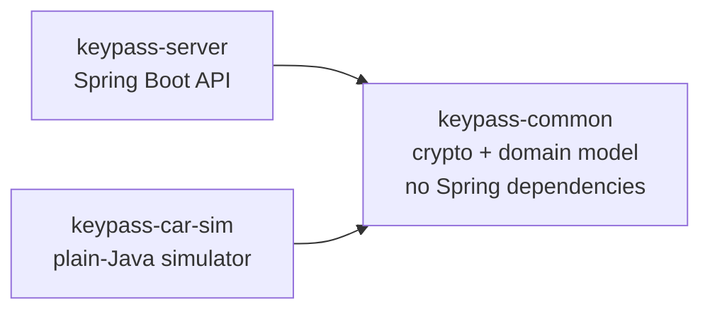
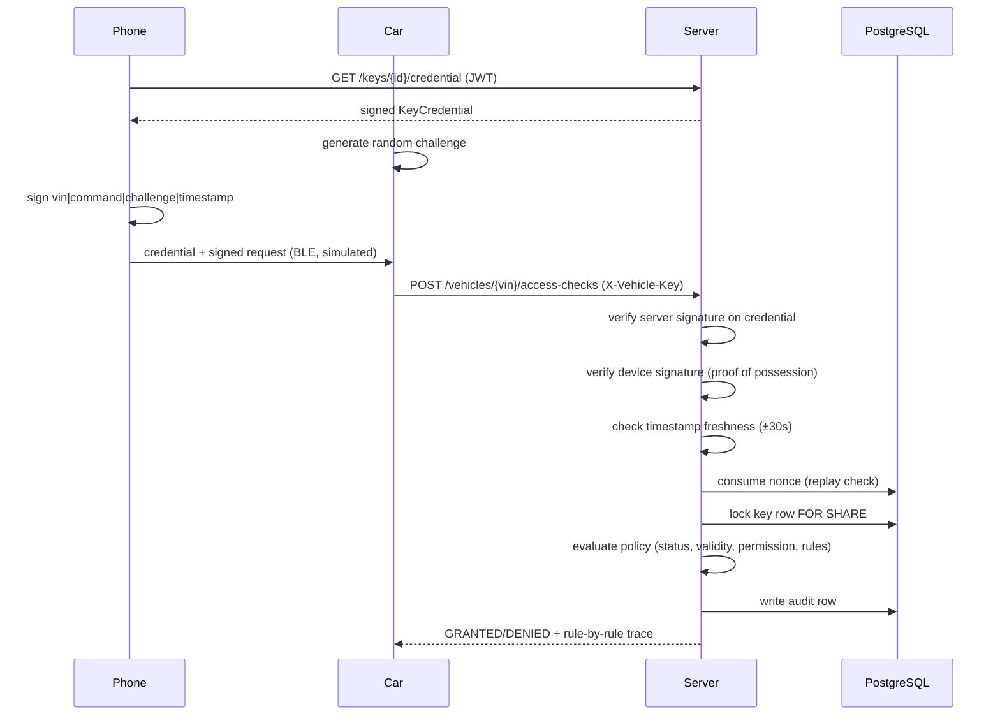

# Architecture

## Modules

`keypass-common` has no Spring dependencies (enforced by `ArchitectureTest`) specifically so the
car/phone simulator can depend on the exact same crypto and credential code the server uses,
without pulling in Spring. That's a real correctness property, not just a style preference: if
the simulator's signing code ever drifted from the server's verification code, every scenario
would either falsely pass or falsely fail.

## Request flow: online unlock

Two kinds of token are in play, worth keeping distinct:

- **User login JWT** — proves *who you are* to the API. Short-lived (15 minutes), RS256, issued
  by `JwtService`.
- **Key credential (Ed25519)** — proves *what you're allowed to do to a specific car*. Verifiable
  by the car itself, online or offline, without calling back to the server. See ADR 0002.

## Offline flow

A car with no signal downloads a bundle (`GET /vehicles/{vin}/offline-bundle`) ahead of time
containing the server's public keys and a Bloom filter of currently-revoked keys for that
vehicle. While offline it verifies credentials, device signatures and its own local nonce set
exactly as it would online, evaluates the embedded policy locally, and queues what it did to
upload via `POST /offline-events` once it reconnects. See ADR 0005 for the fail-safe reasoning
behind the bundle's 24-hour expiry.
